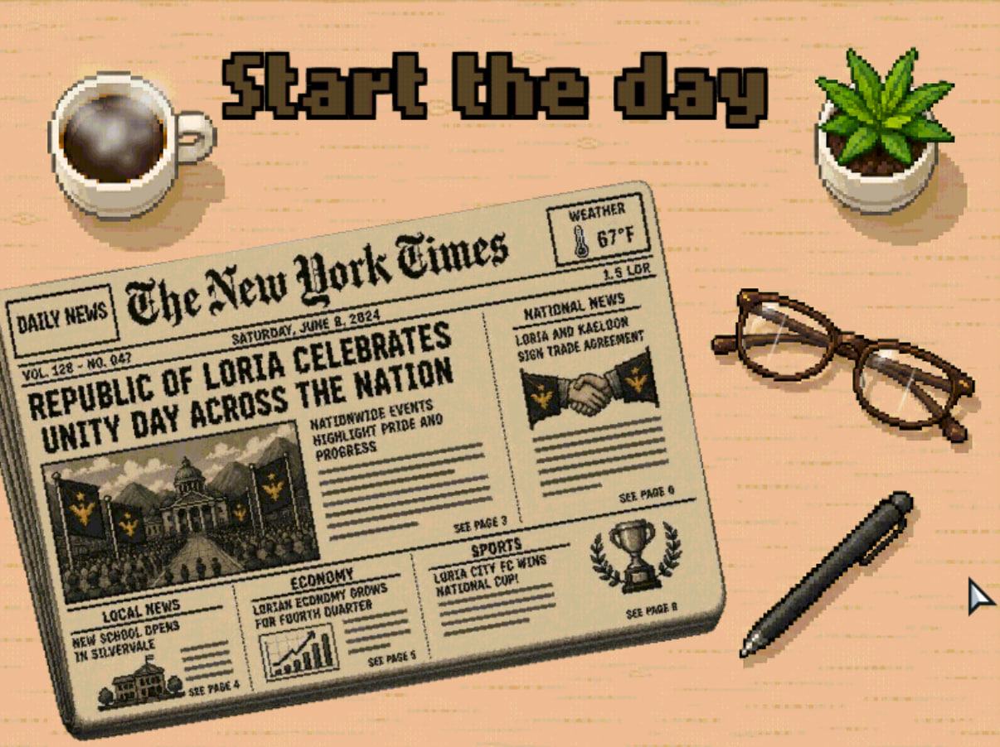
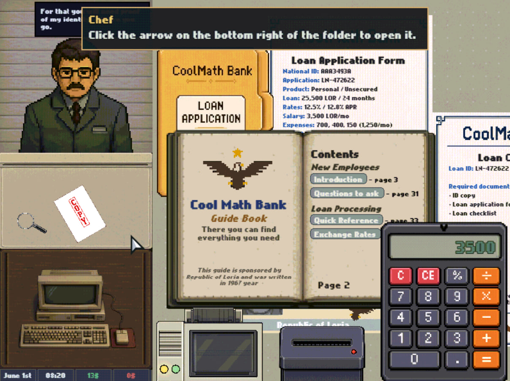
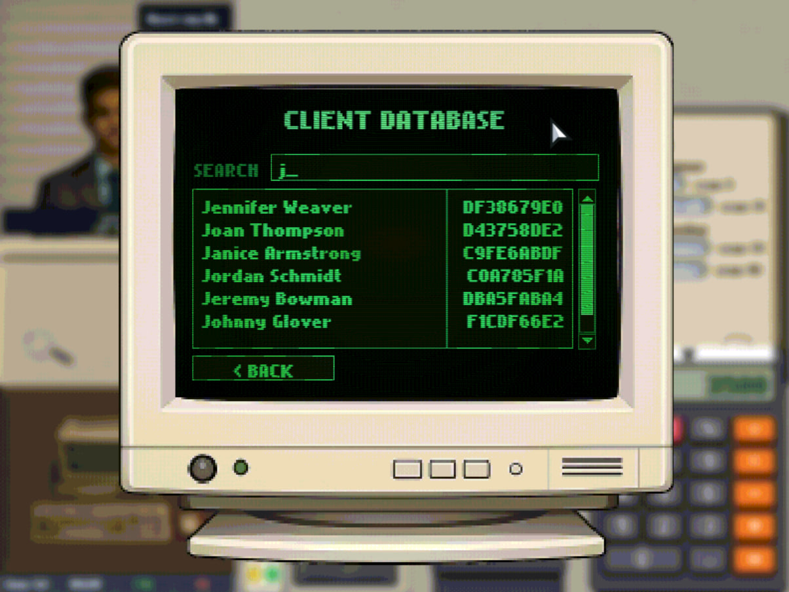
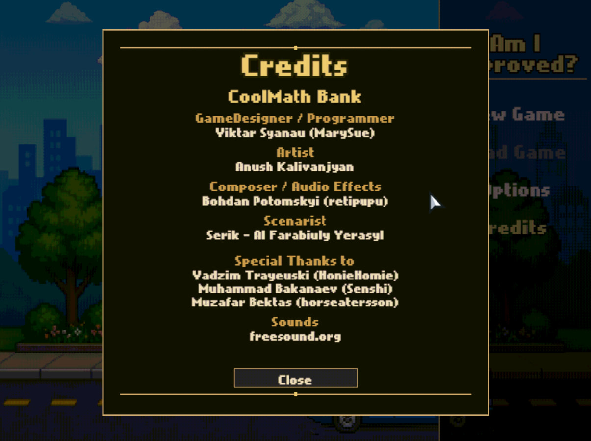

# Am I Approved?

A bureaucratic loan desk sim set in the Republic of Loria, circa 1967. You were hired as employee **#447-B** to approve loans, reject loans, and look busy between visitors. Management has full confidence in you. Management also left early.

**[Play in your browser →](https://marysue.itch.io/am-i-approved)**

## About

Clients arrive at your desk with stories, passports, and paperwork that does not always add up. Your job is to listen, inspect, compare, and decide who gets the money.

**What you'll do**

- **Talk to clients** — small talk, pointed questions, and the occasional lie you pretend not to notice
- **Inspect documents** — drag passports, ID cards, and contracts onto your desk and cross-check every detail
- **Work on the computer** — search the citizen database, edit records, and file loan applications on a green-screen bank terminal

**Features**

- Client dialogue and scenarios with dry, workplace humor
- Document inspection and comparison — passports, IDs, contracts, and more
- Retro bank terminal with citizen search, loan applications, and calculators
- Tutorial and employee handbook to walk you through day one
- A fully stocked desk: printer, shredder, calculator, loan folder, magnifying glass, and too much paperwork
- Pixel-art desk sim at 800×600

## Screenshots

<table>
  <tr>
    <td width="50%" valign="top">
      <strong>Start the day</strong> — Skim the morning paper over coffee before the first client arrives. The Republic of Loria keeps busy even when management does not.
      <br><br>
      
    </td>
    <td width="50%" valign="top">
      <strong>The desk</strong> — Loan folders, the guide book, and Chef's day-one coaching. Cross-check applications against salary, expenses, and whatever the client forgot to mention.
      <br><br>
      
    </td>
  </tr>
  <tr>
    <td width="50%" valign="top">
      <strong>Client database</strong> — Search citizen records on the green-screen CoolMath Bank terminal. Verify names, IDs, and details before you approve anyone.
      <br><br>
      
    </td>
    <td width="50%" valign="top">
      <strong>Credits</strong> — The team behind the desk sim, from the main menu's rainy city backdrop.
      <br><br>
      
    </td>
  </tr>
</table>

## Coolmath Game Jam 2026

This game was created for **[The $20K Coolmath Game Jam 2026](https://itch.io/jam/coolmath-game-jam-2026)**, hosted by Coolmath Games. The jam theme was **Break the Bank** — games about using money wisely and teaching financial literacy.

*Am I Approved?* puts those ideas into practice: you evaluate loan requests, compare income and expenses, spot inconsistencies in documents, and decide who can afford to borrow. The in-game project name *Break the Bank* reflects the jam theme; the public title is *Am I Approved?*

## Credits

| Role | Name |
| --- | --- |
| Game designer / programmer | Viktar Syanau (MarySue) |
| Artist | Anush Kalivanjyan |
| Composer / audio effects | Bohdan Potomskyi (retipupu) |
| Scenarist | Serik - Al Farabiuly Yerasyl |

**Special thanks:** Valeria Paziuk, Vadzim Trayeuski (HonieHomie), Muhammad Bakanaev (Senshi), Muzafar Bektas (horseatersson)

Sounds from [freesound.org](https://freesound.org)

## Development

Built with **HaxeFlixel** on **OpenFL**, targeting **800×600** (HTML5 and desktop).

**Requirements:** Haxe, OpenFL, Lime, HaxeFlixel

```bash
lime build html5
lime test html5
```

**Release build and itch.io zip** (patches `index.html` for itch.io hosting):

```powershell
.\scripts\package_itchio.ps1
```

Output: `dist/BreakTheBank-itchio.zip`
